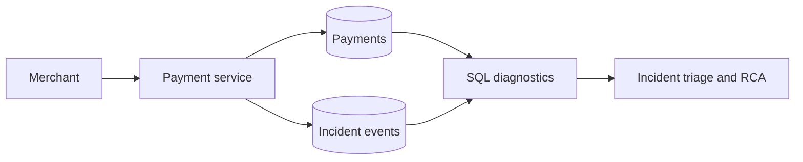
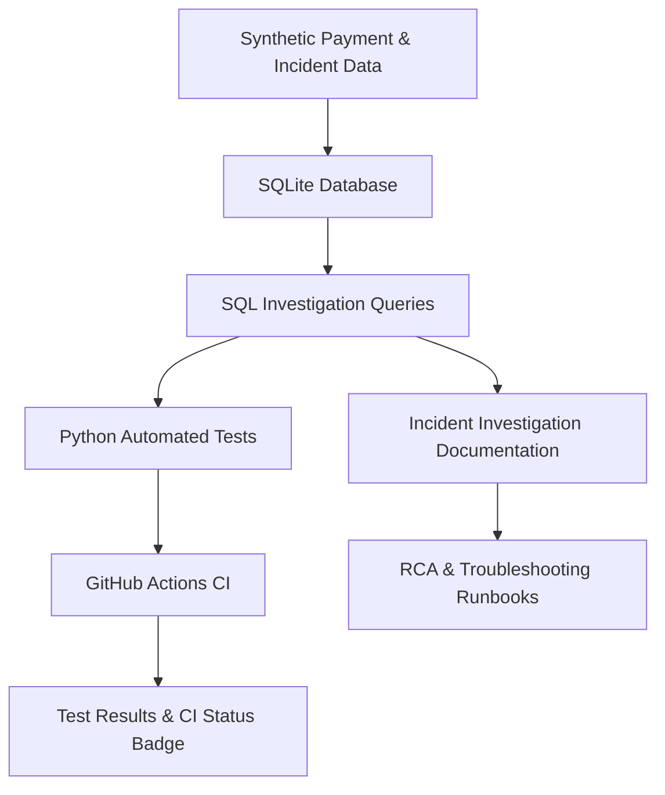

# SQL Troubleshooting Knowledge Base
[](https://github.com/praveenkoppad916-hue/sql-troubleshooting/actions/workflows/sql-tests.yml)

**Practical SQL investigations for payment operations, application support and production incident response.**

  

A hands-on learning and demonstration repository by **Praveen Koppad**, Technical Support & Implementation Engineer. Explore realistic, **fictional** payment records to investigate failed transactions, pending payments, suspected duplicates and performance concerns using reproducible SQL.

> **Scope:** This is an independent educational lab. It does not contain employer source code, customer records, proprietary system diagrams or claims about specific real-world incidents.

## Version 2.0: five hands-on investigation scenarios

The repository now includes [five documented scenarios](docs/ADVANCED_SCENARIOS.md) with executable SQL, synthetic incident tickets, SLA policies and automated checks:

1. Failed payment investigation and event correlation
2. Suspected duplicate transaction detection
3. P1/P2 incident timeline and RCA triage
4. Query-plan inspection and indexing
5. First-response SLA breach analysis

**Quick start:** `python scripts/run_demo.py` then `python -m unittest discover -s tests -v`.

## What you can explore
| Area | Techniques | Example question |
|---|---|---|
| Payment failures | JOIN, WHERE, GROUP BY | Which failure codes recur? |
| Possible duplicates | Composite grouping, HAVING | Which order references appear more than once? |
| Stale pending payments | Timestamp arithmetic | Which payments have remained pending beyond a threshold? |
| Event correlation | LEFT JOIN, ORDER BY | What happened before a payment timeout? |
| Merchant health | Conditional aggregation | Which merchants show elevated failure rates in the sample? |
| Query tuning | Indexes, EXPLAIN QUERY PLAN | Is the database using an appropriate index? |

## Architecture at a glance


For the full conceptual architecture and data model, see [Architecture](docs/ARCHITECTURE.md).

## Run locally (Python 3; no extra packages)
From the repository root:

```bash
python scripts/run_demo.py
```

The script creates an **in-memory SQLite database**, loads the schema and fictional data, and executes the example query files. It does not connect to a live database.

Run verification tests:

```bash
python -m unittest discover -s tests -v
```

## Repository map
```text
sql-troubleshooting/
├── README.md
├── schema/
│   ├── 01_schema.sql
│   ├── 02_seed.sql
│   ├── 03_support_cases.sql
│   └── 04_support_seed.sql
├── queries/
│   ├── 01_foundations.sql
│   ├── 02_incident_investigations.sql
│   ├── 03_performance.sql
│   ├── 04_failed_payment_investigation.sql
│   ├── 05_duplicate_detection.sql
│   ├── 06_p1_p2_incident_analysis.sql
│   ├── 07_query_optimization.sql
│   └── 08_sla_breach_analysis.sql
├── docs/
│   ├── ARCHITECTURE.md
│   ├── INCIDENT_RUNBOOK.md
│   ├── LEARNING_PATH.md
│   └── ADVANCED_SCENARIOS.md
├── scripts/run_demo.py
├── tests/test_queries.py
├── tests/test_advanced_scenarios.py
├── .gitignore
└── LICENSE
```

## Investigation notes
- Duplicate external references are **candidates for review**, not proof of double settlement.
- A gateway timeout does **not** establish whether funds moved.
- Financial values are stored in **minor currency units** (`amount_cents`); avoid summing unlike currencies.
- Timestamps here are illustrative strings. Production systems need explicit time-zone handling.
- Query syntax targets **SQLite**; PostgreSQL, MySQL and SQL Server may require changes.

## System Architecture


