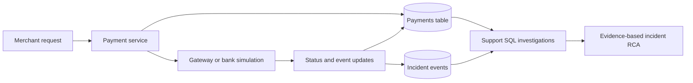
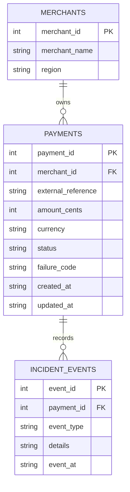

# Synthetic payment troubleshooting architecture

This is a **conceptual teaching model**, not an internal company architecture or a production integration. All records are fictional. The project runs on SQLite for zero-dependency local practice. SQL dialects and production payment semantics vary.

## Data model

